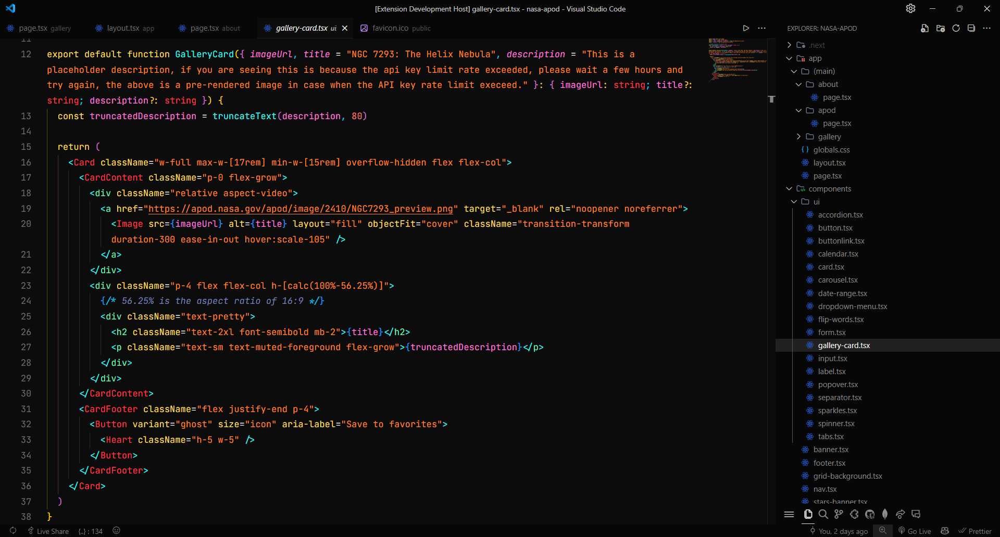

# SynthWave '84 Remix Min Darker

Check out the Source Project: [SynthWave '84 Remix Min Darker](https://github.com/FernaandoJr/synthwave-remix-min-darker)

Fork of LuanKY [Synth Wave '84 Min Theme](https://marketplace.visualstudio.com/items?itemName=LuanKY.synth-wave-min-theme) with a more darker background based on [Min Darker Theme](https://marketplace.visualstudio.com/items?itemName=gmsgarcia.min-darker-theme)

> Now with a new variant totally based on Min Dark Theme, with a little tweaks and the background more darker!

Make sure to check it out original extensions!

